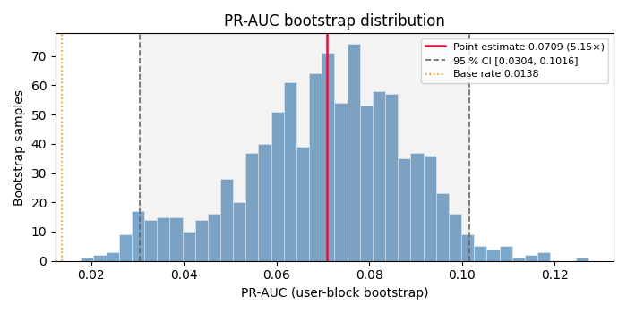
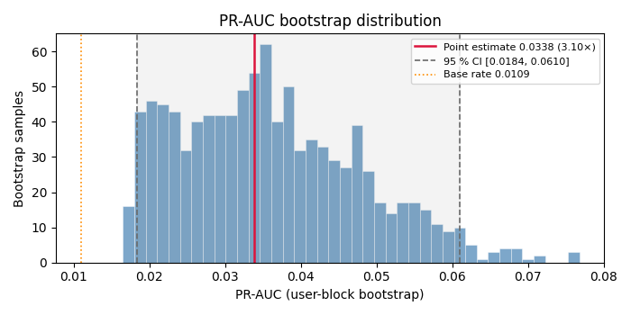
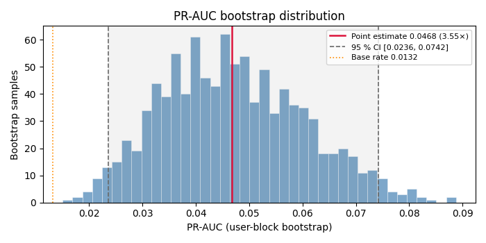
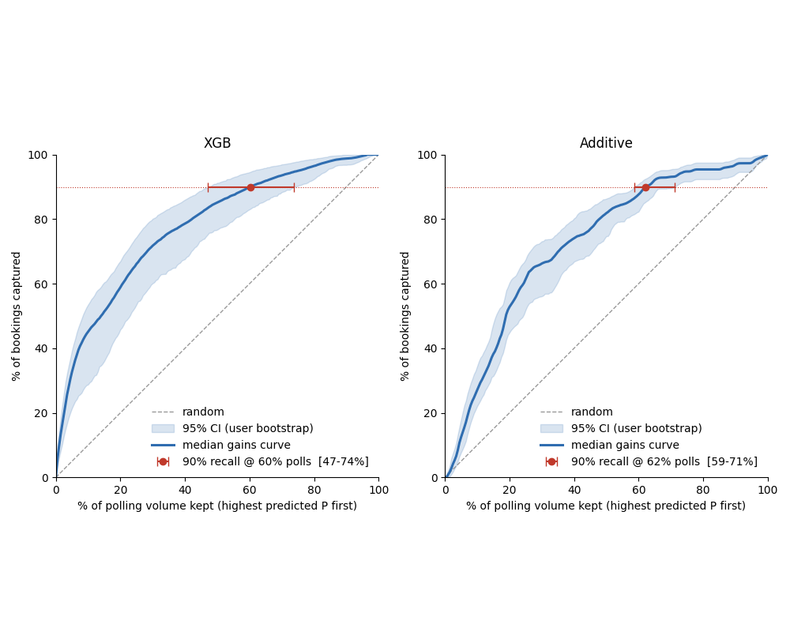
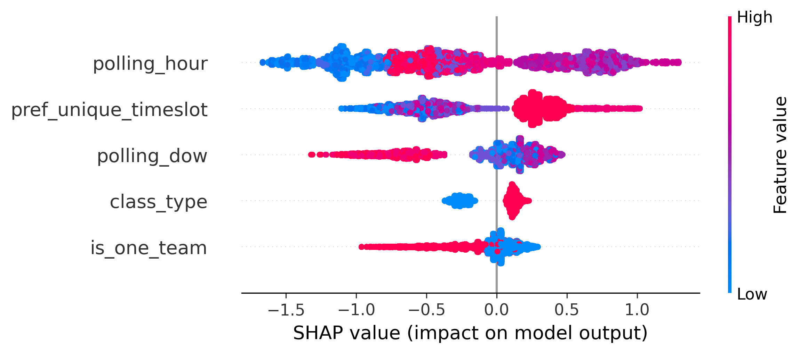

# Booking Prediction Model (`cdc_ml`)

Ranks each poll by how likely it is to land a slot, so the system can **skip the dead polls without losing bookings.**

A production bot re-checks each customer's preferred day/time slots every few minutes and grabs slots that open up when other learners cancel. Polling is cheap per-poll but adds up. This model scores upcoming polls so we keep only the high-value ones.

The key wrinkle: the signal is **supply-side**. A slot appears only when someone cancels, so the question isn't "does the customer want this slot" (they already said so) but "is a matching slot likely to free up around now." That makes it a problem about *when* polls happen and *how wide* a customer's preferences are.

Full writeup is in `4.01-report`; this is the summary.

## Data

| | |
|---|---|
| Source | Polling logs + customer-type table + preference windows (anonymized) |
| Grain | One row per `(customer, polling_hour)` — timestamps aren't kept, so hourly is the finest we get |
| Size | 37 customers · 29,612 rows · 390 bookings (**1.3% base rate**) |
| Span | ~9 months |
| Validation | Pandera schemas on every table (timestamp integrity, `pref_start < pref_end`, range checks) |

Two biases worth stating up front, since they decide what the metrics mean:

- **Success-conditioned** — almost every retained cycle has ≥1 booking, which over-represents easy customers and compresses the real gap between one-team and common-pool groups.
- **Preference-conditioned** — the bot only polls inside declared preferences, so the data only covers those regions. Anything outside is extrapolation — but that's exactly how the live system behaves too.

So the numbers are **relative ranking quality on this sample**, not population booking rates.

## Evaluation

- **Grouped by `username`** for the holdout and CV — polls from one customer look nearly identical, so a row-level split leaks. The goal is cold-start performance on new customers. `username` is a grouping key, never a feature.
- **`StratifiedGroupKFold`**, ~20% of customers held out (train 30 / test 7).
- **PR-AUC primary** — at 1.3% positives, ROC-AUC stays high on the negatives and hides everything. Brier secondary; gains curve is the operational metric.
- **Bootstrap over customers, not seeds** — a few whales dominate, so reseeding just reshuffles them. Resampling customers hits the real source of variance.
- **Whale vs non-whale reported separately** — ~5 customers drive half the bookings, so pooled numbers can hide segment behavior.

## Features

Four candidate families, filtered on: available at inference, not redundant, actually lifts.

| Family | Outcome |
|---|---|
| Polling | Kept `polling_hour`, `polling_dow`; dropped `polling_day` (redundant) and `polling_month` (only 9 months) |
| Preference | Collapsed to **`pref_unique_timeslot`** — the rest were correlated views of the same window |
| Customer-type | Kept `class_type`, `is_one_team` — main axis of booking difficulty |
| Cycle | Dropped all — some unavailable at inference, others redundant, plus a `00:00` backlog artifact |

**Final 5:** `polling_hour`, `polling_dow`, `pref_unique_timeslot`, `class_type`, `is_one_team`.

Preference features are deterministic from the cycle config, so no per-fold fitting and no leakage.

## Baseline

Smoothed lookup tables on timing only:

- Additive vs joint `dow × hour` LUT are indistinguishable (+0.003 PR-AUC vs 0.013 fold SD) → **no weekday×hour interaction.**
- RF and XGBoost on the same features land on the additive LUT — flexibility buys nothing here.
- Time-only ceiling ≈ **2.1× base rate.** Anything more has to come from preference/customer features.

## Ablation

Deltas are read as effect sizes, not significance tests. Leave-one-out plus group ablation, since correlated features mask each other.

| Stage | Action | Pooled PR-AUC |
|---|---|---|
| 1 | Drop `pref_dow` (7 sparse counts) | ~no change → out |
| 2 | Collapse preference block | removing the other three together → no loss |
| 3 | Validate final 5 | `class_type` −38%, `is_one_team` −43%, `pref_unique_timeslot` −54% |

The tell: dropping `pref_unique_timeslot` cost **18% in the 8-feature model but 54% in the 5-feature model.** It didn't get more predictive — pruning the correlated features un-masked it.

## Model & calibration

- **XGBoost**, tuned with `RandomizedSearchCV` (50 iters) on `average_precision`, same grouped CV.
- **`refit=False`** → best params go to JSON, `train.py` does the final fit + calibration. Selection and training stay separate and reproducible from disk.
- **Platt scaling on pooled OOF** — OOF scores never saw their own rows, so they mimic deployment. Platt over isotonic because there are too few positives for isotonic to stay stable.

## Results

OOF cold-start is the headline; the untouched test set is a lower but cleaner check.

| | Users | Base | PR-AUC | Lift | 95% CI |
|---|---|---|---|---|---|
| **OOF (cold-start)** | 30 | 1.4% | 0.071 | **5.1×** | [2.2×, 7.4×] |
| Test | 7 | 1.1% | 0.034 | 3.1× | [1.7×, 5.6×] |
| Production (all data) | 37 | 1.3% | 0.047 | 3.6× | [1.8×, 5.6×] |

*PR AUC with 95% CI from customer-level bootstrap resampling of the OOF predictions*

*PR AUC with 95% CI from customer-level bootstrap resampling of the held out set*

*PR AUC with 95% confidence intervals from customer-level bootstrap resampling of out-of-fold predictions over the full dataset*

The OOF–test gap is mostly noise: the CIs overlap, the test set is 7 customers (its whale segment is basically one person), and there's some train↔test shift (adversarial AUC 0.81). OOF also doubled as the selection metric, so it runs a bit optimistic — the lower test number fits that, not a generalization failure.

**Gains curve** — keep the top X% of polls by score, how many bookings survive?

| | XGBoost | Additive baseline |
|---|---|---|
| Polls to keep **90%** of bookings | ~60% | ~62% |
| Polls to keep 80% | ~43% | ~48% |
| Bookings in **top 10%** of polls | **~46%** | ~27% |

*Gain curve for XGB and the basline additive model*

Most of the value is in timing alone — even the baseline keeps ~90% of bookings at ~40% fewer polls. XGBoost's edge shows up at the selective end (46% vs 27% in the top 10%). Headline: **30–50% fewer polls, ~90% of bookings kept.**

**Per-customer guardrail** — at a 60% polling budget, whales keep a median 92% of bookings, non-whales 100%. The occasional zero is a customer with 1–2 bookings where one miss tanks a tiny denominator — useful for catching starvation cases before launch.

*Recall by segement of the OOF prediction*

*Recall by segement of the held out test set*

*Recall by segement of the OOF prediction on the full dataset*

## Interpretation (SHAP)

Importance: `polling_hour` > `pref_unique_timeslot` > `polling_dow` > `class_type` > `is_one_team`.

- `polling_hour` — negative overnight, positive midday: cancellations cluster in daytime.
- `pref_unique_timeslot` — threshold shape, 6–7 slots help, ≤5 hurt: wider preferences mean more chances to match.

*SHAP beeswarm plot showing global feature importance and contribution direction.*

## Limitations

Sample-specific metrics (success/preference-conditioned), a small customer count driving most of the uncertainty, an offline gains curve that only live deployment can confirm, hourly + preference-window scope, and 9 months too short for seasonality.

## Operational use

The cutoff is a **score quantile** (e.g. top 50% of polls), recomputed periodically to track drift. Calibrated scores let us estimate retained bookings straight from probability mass, no waiting for outcomes — as long as calibration holds (the 0.81 adversarial AUC is the thing to watch). Per-customer recall runs as a guardrail. The projected savings are a forecast until a live test confirms them.

## Stack

Cookiecutter DS · Pandera · Typer CLI · loguru · Parquet · XGBoost / scikit-learn / SHAP. Pipeline: `clean_records.py` → `features.py` → tuning → `train.py`.
